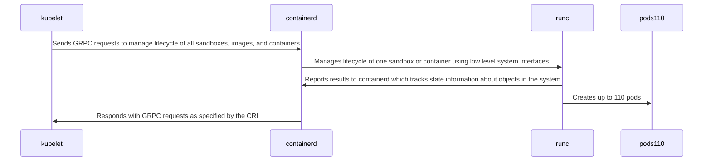

# Need

The technology industry needs technology to securely run multitenant workloads using Kubernetes
without the overhead of hardware-assisted virtualization.

For background, Kubernetes's scheduler delivers good bin packing results for small vertical-scale
node configurations. Kubernetes has a fundamental upper limit of 110 pods. Kubernetes depends on
a virtualization layer to achieve good density.

Using Kubernetes with a virtualzation layer causes significant CPU and memory overhead.
The hypervisor processes all device access through the Intel IOMMU hardware, often called VT-d.
In the case of networking, the hypervisor copies all information from the host interface to the
virtual machine interface usually using a virtual interface. Intel's SRIOV alleviates some of this
overhead by creating virtual PCI functions. These virtual PCI functions enable direct routing
of information to a virtual machine network interface. Unfortunately, SRIOV has a limited number
of virtual functions, making it unsuitable for significant vetical scale. As a result, any
PCI card that implements SRIOV, such as NVME storage or AI processors, suffers from this extra work.
Additionally, modern virtualization platforms must pin virtual machine memory to use SRIOV.

# Approach

Although this approach applies to any operating system, Linux provides a real-life example to
describe the approach.

Kubernetes is an orchestration engine with the primary purpose of bin packing workloads
at a sizeable horizontal scale. Kubernetes has a generally agreed limit of 110 pods per
node and a generally agreed horizontal scale limit of 500 nodes with this pod limit. Modern
Kubernetes systems rely on hardware-assisted virtualization to partition one multicore system
into many smaller virtual machines to achieve density with secure isolation. A complete
Linux operating system runs within these virtual machines, including several lifecycle
management processes that manage the actual workloads. The sequence diagram below shows
the defacto standard components:

In this diagram, containerd implements the Container Runtime Interface. Kubernetes enables swapping of CRI components
to provide operational flexibility. Additionally some CRIs, such as containerd, provide a
[plugin interface](https://github.com/containerd/containerd/blob/main/docs/PLUGINS.md) to modify
the behavior of containerd.

We will develop an approach to deploying Kubernetes using cgroups isolation on bare metal. First,
a bare-metal platform with 128 core 512GiBI is partitioned into 32 nodes using kernel-based
software isolation. Next, the cgroups v2 kernel API partitions the system into 32 nodes with
16GiBi ram each. Next, Kubernetes allocates nodes from a pool provided by a metassembly service.
Finally, Kubernetes communicates with a node's kubelet to connect to containerd running a
metassembly plugin.

# Benefits

Hardware-assisted virtualization has significant overhead. The operating system processes all device access through
the Intel IOMMU hardware, often called VT-d. In the case of networking, the hypervisor copies all information
from the host interface to the virtual machine interface. Intel's SRIOV alleviates some of this overhead
by creating virtual PCI functions. These virtual PCI functions enable direct routing of information to a
virtual machine network interface. Unfortunately, SRIOV has a limited number of virtual functions, making
it unsuitable for a more significant scale. As a result, any PCI card that implements SRIOV, such as NVME
storage or AI processors, suffers from this extra work. Additionally, the operating system must pin virtual
machine memory to use SRIOV with modern virtualization stacks.

The proposed approach enables running Kubernetes on bare metal which removes hardware-assisted virtualization overhaed.
.
# Competition

- A complete listing of competitive or potentially competitive projects is listed in containerd's
[ADPTORS.md](https://github.com/containerd/containerd/blob/main/ADOPTERS.md)
