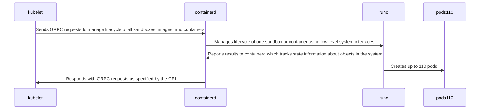

# Need
The technology industry needs technology to securely run multitenant workloads using Kubernetes without hardware-assisted
virtualization.

# Approach

Although this approach is applicable to any operating system, Linux is used as a real life example to describe the approach.

Kubernetes is an orchestration engine with the primary purpose of binpacking workloads at large horizontal scale. Kubernetes
has a generally agreed limit of 110 pods per node, and a generally agreed horizontal scale limit of 500 nodes with this pod
limit. To achieve density, modern Kubernetes systems rely on hardware-assisted virtualization to parittion one multicore
system into many smaller virtual machines. Within each of these virtual machines, a complete Linux operating system
is run including several lifecycle management processes that manage the actual workloads. The sequence diagram below shows
the defacto standard components:

In this diagram, containerd implements the Container Runtime Interface. Kubernetes enables swapping of CRI components
to provide operational flexibility.

An approach of deploying Kubernetes using cgroup isolation on bare metal will be developed. As an example, a 128 core 512GiBI
system will be partitioned into 32 nodes using kernel based software isolation. The cgroups v2 system is used to parition
a system into 32 nodes with 16GiBi ram each. These nodes can then be treated as a pool of nodes by which a Kubernetes
management system can allocate nodes from. Once the node is registered with a Kubernetes control plane, kubelet will
communicate with a metalssembly container runtime interface.

The metalssembly CRI requirements differ from containerd in several ways:

1. The metalssembly CRI shall cooperate with other metalssembly CRIs on the same physical node.
1. The metalssembly CRI shall run as a non-privleged user.
1. The metalssembly CRI shall create pod sandboxes and containers using rootless container technology.
1. The metalssembly CRI shall not assume its environment is isolated by hardware-assisted virtualization.

# Benefits

As an example, consier a modern CPU containing 128 threads of execution with 512GiBi ram. With a 110 pod limit, it is
unlikely that good CPU or memory density is achievable on bare metal unless these processes were extremely heavy weight.

To achieve good binpacking results, A typical production Kubernetes node may be 4 CPUs with 16 GB of ram. This
would generally be able to handle most worklaods up to the 110 pod limit. When more than 110 pods are scheduled, more nodes
are required. A single bare metal node is then partitioned using hardware-assisted virtualization into 32 nodes with 16gb
ram each. Multiple hardware nodes may then be joined together into one cluster, up to the 500 node limit, for a total of
64000 threads of execution with access to 8000GiBi of ram. In this way, large scale is achievable.

Hardware assisted virtualzation has significant overhead. On Intel platforms, all device access is processed through
a hardware-assisted IOMMU lookup table. In the case of networking, each byte of information is copied from the host
interface to the virtual machine interface. SRIOV allieviates some of this overhead by creating virtaul PCI functions.
These virtual PCI functions enable direct routing of information to a virtual machine network interface. Unfortunately SRIOV
has a limited number of virtual functions, which make it unsuitable at larger scale. Any PCI card that implements SRIOV,
such as NVME storage or AI processors suffers from this extra work. Additionally, virtual machine memory must be pinned
to use SRIOV with modern virtualzation stacks.

The proposed approach enables running Kubernetes on bare metal which removes hardware-assisted virtualization overhaed.
.
# Competition

- Frakti is a CRI which runs each container in a virtual machine, Metalssembly does not use hardware-assisted virtualization.
- Containerd is a CRI which assumes full control over environment. Metalssembly cooperates with other CRIs on the same node.
Probably more :)
